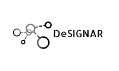

# DeSiGNAR (Data Structures GeNeral librARy)

This is the beginning of a complete project which is expected to be
a general library to make different kinds of models and simulation.

The structure of this library is:

| Directory        | Description|
| :-------------: |:-------------|
| *include*     | Contains all the header files. |
| *src*      | Contains some test and demos with the usage of the differents developed abstractions.|
| *samples* | In this directory will be created all the objects files when you compile the library. |
| *obj* | When you compile the library, in this directory will be added the file **libDesignar.a.**|
| *lib* | When you compile the samples, in this directory will be added the binary files to execute.|
| *bin* | Cuando sea compilada la biblioteca, en este directorio serán creados los archivos binarios a ejecutar.|

In order to compile the library you must execute 

```shell

~$ make library

```
In order to compile the samples you must execute 

```shell

~$ make samples

```

## TODO:

- [x] Start documentation.
- [ ] Tarjan Algorithm for computing strong connected components to Digraph.
- [ ] Making test for Graph and Digraph.
