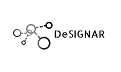

# DeSiGNAR (Data Structures GeNeral librARy)

This is a library that implements important generic Data Structures and
algorithms.

The structure of this library is:

| Directory        | Description|
| :-------------: |:-------------|
| *include*     | Contains all the header files. |
| *src*      | Contains all the source files (implementations declared in headers.|
| *samples* | Contains some test and demos with the usage of the differents developed abstractions.|
| *obj* |In this directory will be created all the objects files when you compile the library.|
| *lib* |When you compile the library, in this directory will be added the file **libDesignar.a.**|
| *bin* |When you compile the samples, in this directory will be added the binary files to execute.|


## Getting started

- Build the static library

  ```shell
  $ make library
  ```

- Compile samples 

  ```shell
  $ make samples
  ```

## TODO:

- [x] Start documentation.
- [ ] Tarjan Algorithm for computing strong connected components to Digraph.
- [ ] Making test for Graph and Digraph.


