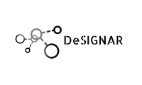

# DeSiGNAR (Data Structures GeNeral librARy)

A teaching-oriented C++17 library of generic data structures and algorithms:
arrays, lists, stacks/queues, several balanced-tree flavors (AVL, red-black,
treap, splay, randomized BST), hash tables (chained and open-addressing),
heaps, graphs and graph algorithms, geometry primitives, string algorithms,
and a handful of concurrency-aware containers.

Unlike a from-scratch student exercise, every container here is meant to be
STL-compatible: standard iterator categories, move semantics, non-default-
constructible/move-only value types where the underlying algorithm allows
it, and heterogeneous (transparent) lookup on the ordered/hashed
containers. The point isn't just to show *an* implementation of, say, a
red-black tree — it's to show one you could actually drop into real code
next to `std::vector` or `std::map` without it feeling like a toy.

## Quick start

```cpp
#include <iostream>
#include <avltree.hpp>

using namespace Designar;

int main()
{
    AVLTree<int_t> tree;

    for (int_t v : {5, 3, 8, 1, 4, 7, 9})
        tree.insert(v);

    for (int_t v : tree)          // in-order traversal
        std::cout << v << " ";
    std::cout << "\n";

    tree.remove(4);
    std::cout << "search(4): "
              << (tree.search(4) != nullptr ? "found" : "not found") << "\n";
}
```

Every container/algorithm family has an equivalent runnable example under
`samples/src/demo-*.cpp` — see the "Modules" section below for the full
list grouped by topic, and "Documentation" for the full generated API
reference covering everything each type exposes.

## Modules

The API reference groups everything into the following modules (this is
also how the generated Doxygen site's "Modules" page is organized — see
`docs/groups.dox`):

| Module | Covers |
| :----- | :----- |
| Data structures | B-trees, B+ trees, skip lists, tries, LRU caches, pairing heaps, bloom filters, union-find, plus the foundational array/list/stack/queue/heap/map/set family at the top level of `include/`. |
| Trees | Tree/RankedTree (plain/unbalanced), AVL, red-black, treap, splay, randomized BST, plus `BPlusTree` and `RankedRBTree` — each pairing a plain flavor with its order-statistics-capable `Ranked*` sibling where one exists, all sharing one node layout and rotation implementation. |
| Graphs | `Graph`/`Digraph` containers, all-pairs shortest paths, max flow, bipartite matching, bridge-finding, strongly-connected components (Kosaraju's and Tarjan's algorithms). |
| Geometry | 2D points/vectors/segments/polygons/triangles, closest-pair, quadtrees, Voronoi diagrams. |
| Sorting | Comparison sorts and the heterogeneous-key search helpers backing the map/set containers. |
| Algorithms | Generic algorithms over iterators/containers: string algorithms, the container/iterator algorithm mixins reused everywhere else, elementary number theory (gcd, modular exponentiation/inverse), and the classic randomized algorithms (randomized order statistics, Miller-Rabin primality testing, reservoir sampling, Karger's min-cut). |
| Hashing | `SeparateChainingHashTable`/`OpenAddressingHashTable` underlying `HashMap`/`HashSet`, a hash-function collection (including MD5/SHA-1/SHA-256 for security use), and `HashChain` for iterated hash-chain (S/KEY-style OTP) verification. |
| Concurrency | Thread pool, concurrent map, graph agent + concurrent graph for parallel graph exploration. |
| Compilers | Grammars with FIRST/FOLLOW computation and optional operator precedence/associativity declarations, a lexer, an LL(1) predictive parser, and the full LR family (SLR(1), canonical LR(1), LALR(1)) — the LR family drives yacc-style semantic actions live during the parse to build a real, typed AST, suitable for an interpreter or a translator. |
| Automata | Finite automata (NFA/DFA, subset construction), a Turing machine simulator. |
| Cellular automata | Dense and sparse grid representations for cellular-automaton simulation. |
| Linear algebra | Vector and matrix types with the usual arithmetic. |
| Artificial intelligence | Minimax search with alpha-beta pruning, plus a collection of metaheuristics (genetic algorithm, ant colony/artificial bee colony/particle swarm optimization, simulated annealing) and a feedforward neural network. |
| Utilities | Timing, string formatting, integer helpers, and the library's fundamental type aliases (`nat_t`, `int_t`, `real_t`, ...). |

## Design philosophy

A few decisions that show up repeatedly across the codebase, in case they
look surprising in isolation:

- **CRTP mixins over inheritance-by-copy-paste.** `ContainerAlgorithms`
  and `SetAlgorithms` (see the Algorithms module) give every container a
  shared implementation of generic traversal/search/set-algebra
  operations; a container opts in by inheriting the mixin and providing
  `begin()`/`end()` (or the set-specific primitives), not by
  reimplementing `for_each`/`map`/`find`/... itself.
- **Shared node primitives, per-algorithm metadata.** Every balanced tree
  (Trees module) is built on the same `BaseBinTreeNode` and the same
  `generic_rotate_left`/`generic_rotate_right` pointer-relinking
  functions; only the bookkeeping a given balancing scheme needs (AVL
  height, red-black color, subtree count, ...) lives in that tree's own
  code.
- **`assert()` for internal invariants, exceptions at the boundary.**
  Genuine usage errors (e.g. calling `top()` on an empty stack) throw;
  invariants that should be impossible to violate from outside the
  library are guarded by `assert()`, which is why `-DNDEBUG` builds and
  `-DDESIGNAR_WARNINGS_AS_ERRORS=ON` don't mix cleanly for the test suite
  (see the CMake options table below).
- **Sanitizers as part of the test matrix, not an afterthought.** CI runs
  the full suite under ASan+UBSan and separately under TSan (see the
  `DESIGNAR_SANITIZE_*` options below) — several real bugs in this
  library's history were only ever caught this way.

## Directory structure

| Directory  | Description |
| :--------- | :----------- |
| `include`  | All header files (this is a header-heavy, template-based library — most of the actual code lives here). |
| `src`      | Implementation files for the pieces that aren't fully header-only. |
| `samples`  | Small demo programs showing how to use the various data structures. |
| `tests`    | The test suite, one executable per data structure/algorithm area. |
| `cmake`    | CMake helper modules (compiler/platform detection, package config template). |
| `obj`, `lib` | Build output for this repo's own in-tree build (see below); not present until you build. |

## Requirements

- A C++17 compiler: GCC ≥ 9, Clang ≥ 14, or MSVC (Visual Studio 2019+).
- CMake ≥ 3.20.
- Threads (used by the concurrency-aware containers): pthreads on Linux/macOS,
  native threading on Windows — CMake finds this automatically, nothing extra
  to install.

## Building from source

The same CMake invocation works on Linux, macOS, and Windows; only the build
step's syntax differs slightly per platform below.

### Linux / macOS

```shell
mkdir build && cd build
cmake ..
cmake --build . --parallel
ctest --output-on-failure   # run the test suite
```

By default this also builds `samples/` and `tests/`. If you only want the
library (e.g. you're embedding this via `add_subdirectory`), configure with:

```shell
cmake -DDESIGNAR_BUILD_SAMPLES=OFF -DDESIGNAR_BUILD_TESTS=OFF ..
```

To install into a standard prefix (so other projects can `find_package
(Designar)` — see below):

```shell
cmake --install . --prefix /usr/local   # or your prefix of choice
```

### Windows (MSVC)

From a "Developer Command Prompt for VS" (or any shell with `cmake` and MSVC
on `PATH`):

```bat
mkdir build && cd build
cmake ..
cmake --build . --config Debug
ctest -C Debug --output-on-failure
```

MSVC is a multi-configuration generator, so the `--config`/`-C` flag (Debug
here) is required where it isn't on Linux/macOS.

### Docker

No local toolchain needed — a `Dockerfile` at the repo root builds the
library and runs the full test suite inside a clean Ubuntu image:

```shell
docker build -t designar .
docker run --rm designar               # builds, then runs the test suite
docker run --rm -it --entrypoint bash designar   # interactive shell instead
```

### Useful CMake options

| Option | Default | Effect |
| :----- | :------ | :----- |
| `DESIGNAR_BUILD_SAMPLES` | `ON` | Build the demo programs in `samples/`. |
| `DESIGNAR_BUILD_TESTS` | `ON` | Build (and register with ctest) the test suite in `tests/`. |
| `DESIGNAR_WARNINGS_AS_ERRORS` | `OFF` | Treat compiler warnings as errors (what CI builds with). |
| `DESIGNAR_SANITIZE_ADDRESS_UB` | `OFF` | Build with AddressSanitizer + UndefinedBehaviorSanitizer. |
| `DESIGNAR_SANITIZE_THREAD` | `OFF` | Build with ThreadSanitizer (mutually exclusive with the option above). |

> **Note:** the test suite checks itself with `assert()`. Configuring with
> `CMAKE_BUILD_TYPE=Release` (or `RelWithDebInfo`/`MinSizeRel`) defines
> `NDEBUG`, which compiles every `assert()` out — this leaves several
> now-genuinely-unused local variables in the tests, which fails the build
> under `DESIGNAR_WARNINGS_AS_ERRORS=ON`. If you want an optimized build,
> either leave `DESIGNAR_BUILD_TESTS=ON` off, or don't combine `Release`
> with `DESIGNAR_WARNINGS_AS_ERRORS=ON`.

## Consuming Designar from another CMake project

Once installed (see `cmake --install` above, or via vcpkg/Conan below):

```cmake
find_package(Designar REQUIRED)
target_link_libraries(your_target PRIVATE Designar::Designar)
```

### vcpkg

A port lives in-tree at `vcpkg/ports/designar` (not yet in the curated
vcpkg registry):

```shell
vcpkg install designar --overlay-ports=/path/to/DeSiGNAR/vcpkg/ports
```

### Conan

A `conanfile.py` at the repo root builds a Conan 2.x package:

```shell
conan create .
```

### Building a release source archive

`cpack --config CPackSourceConfig.cmake` (run from a configured build
directory) produces `designar-<version>-src.tar.gz`/`.zip` containing only
what's needed to build the library itself (`include/`, `src/`, the CMake
files, `LICENSE`, `README.md`) — not this repo's tests, samples, Doxygen
config, or packaging recipes, which stay in version control for
contributors but have no reason to ship in a release archive.

## Documentation

API documentation is generated with Doxygen (see `Doxyfile`) and published
automatically from `main`; see the `publish_docs` job in
`.github/workflows/build_library.yml` for how, and enable GitHub Pages
("Settings → Pages → Source: GitHub Actions") once on a fork to get your own
copy. This file (`README.md`) is the generated site's main page, and
`docs/groups.dox` declares the module groups (Trees, Graphs, Geometry, etc.)
used to organize the "Modules" page.

To build the docs locally:

```shell
doxygen Doxyfile   # output in doc/html/index.html
```

## License

MIT — see `LICENSE`.
